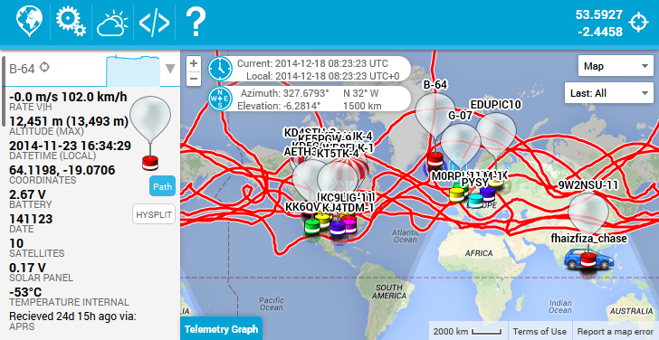

# Habitat Mobile Tracker

A tracker webapp specifically crafted for use on mobile devices.
But, works on any other device - desktops, laptops or netbooks.
The aim is to provide all key features in a compact package useful
on a mobile device. And yet, not feel stripped down on a desktop PC.
The mobile tracker is a continuation of [spacenear.us/tracker](http://spacenear.us/tracker).

Checkout the [Live version](http://habhub.org/mt/)

## Features

* HAB tracking with [Habitat](http://habitat.habhub.org/) ([@github/ukhas/habitat](https://github.com/ukhas/habitat))
* Map tracker with Google Maps API 3
* Chase Car functionality
* [Daylight cycle overlay](https://github.com/rossengeorgiev/nite-overlay), for long flights

### Geo position

The app will ask for permission to use your location.
This is required for some of the features. It is **important** to note that
your location will not be made available or send to anyone. Unless, you enable
 the `chase car mode`, which will periodically upload it to habitat. _The app
will always start with `chase car mode` disabled._

### Offline storage

The app will ask to use offline storage. You will need to accept, in order to
use the offline capabilities. The app will cache all files making it available
even when there is no network coverage. Latest position data will also be stored
and used when you start up with no network. When you get back online, the app
will fetch the latest position data.

## Installation

Requirements: __Java__ and (Linux or Cygwin environment)

    $ git clone git://github.com/rossengeorgiev/habitat-mobile-tracker.git
    $ ./build.sh

For __applicationCache__ to work your server needs to send the correct MIME type.
`.htaccess` for Apache is included. Consult it if you are using different server software.

## Original design

Author: Daniel Saul [@danielsaul](https://github.com/danielsaul)

[See concept for phone portrait mode](https://github.com/rossengeorgiev/habitat-mobile-tracker/blob/master/resources/concept-app-portrait.png)
[See concept for tablets](https://github.com/rossengeorgiev/habitat-mobile-tracker/blob/master/resources/concept-app-tablet.png)

## Currently Supported Devices

### iOS, Android, Desktops

* Modern browser required (IE not supported)
* Browsers supporting _Geolocation API_ will have `Chase car mode` available
* For best experience on _iOS devices_, add the webapp to your home screen.
This will hide Safari's UI and make it look like a native app. I think it also allows it to run in the background.
* Chrome shortcuts for android, but might not keep the app suspended, when switching context

